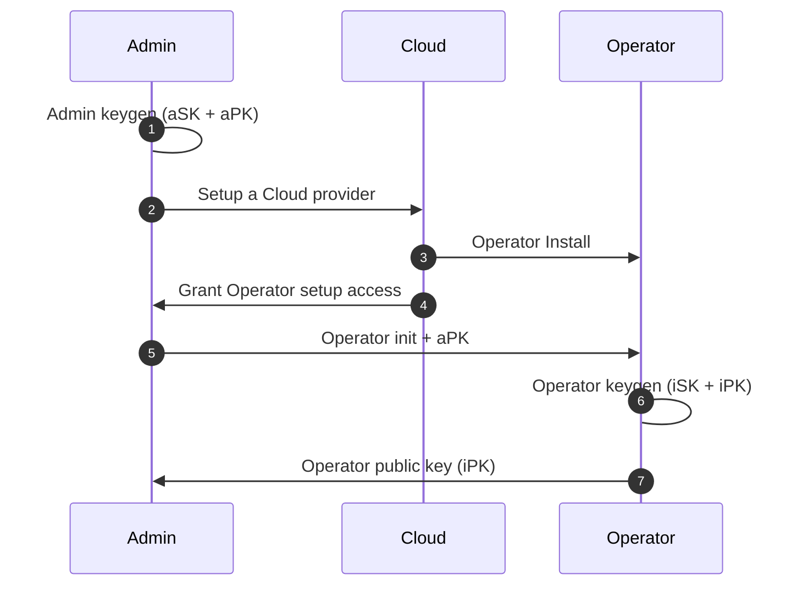
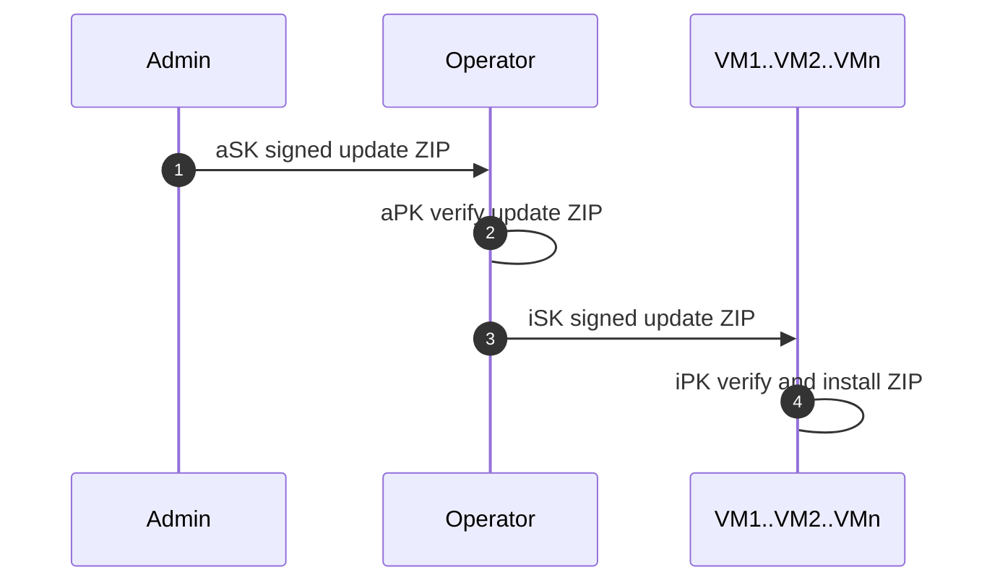
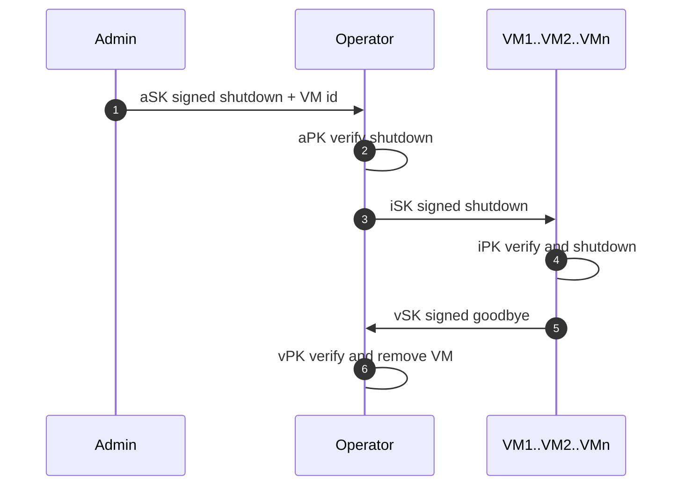

# Zenswarm setup

Documentation of the Swarm of Oracles setup:

- Admin setup of cloud instances
- Admin setup and provisioning of Operator
- Issuance of oracle keys
- Operator provisioning of oracle scripts
- Admin update of issuer and oracle scripts 

## Operator creation

1. Admin is the control terminal and generates a new keypair (aSK + aPK)
1. Admin sets up a Cloud provider (one or more) can be remote or on-premises
1. Operator is created by the Cloud provider and installed with a signed OS
1. Cloud grants to Admin setup access to the Operator
1. Admin initialized the Operator machine with signed scripts and the Admin public key
1. Operator generates an issuer keypair (iSK + iPK)
1. Operator shares its public key (iPK) with the Admin

## VM creation

1. Admin orders the creation of a VM to the Cloud provider
1. Cloud provider creates the VM on a new allocated IP and installs a signed OS
1. Cloud provider grants the Admin setup access to the VM (IP + SSH)
1. Admin signs a message to register the new VM IP on the Operator
1. Admin provisions the VM with a signed OS setup and the Operator public key

## VM key issuance

1. Operator generates an ephemeral keypair used only to verify the VM registration
1. Operator signs the ephemeral secret key with iSK and sends a request to the VM IP
1. VM verifies the registration request with iPK and generates a VM keypair (vSK + vPK)
1. VM signs an answer with eSK and sends back its public key
1. Operator verifies the answer signed with ePK and saves the VM public key and its IP

At the end of the process the ephemeral keys are discarded and the Operator has added to its database a new IP and its associated public key.

## Swarm operation

1. A query is made to the Swarm of Oracles Operator by a User (or an event or a time trigger)
1. Operator parses and validates the query syntax, then propagates to all oracle VMs
1. VMs execute the Zencode associated to the query: may access other online services, query databases and external APIs
1. VMs return results of the Zencode execution or an error
1. Operator verifies that all results are equal (full consensus) or raises an error
1. Operator returns the verified result of the query or a list of specific errors occurred

## VM script update

1. Admin signs and uploads a ZIP with updated scripts
1. Operator verifies the ZIP is signed by the Admin
1. Operator signs and uploads the update ZIP to all VM
1. VM verifies the ZIP is signed by the Operator and installs the scripts

## VM teardown

1. Admin signs and sends a shutdown message for a certain VM
1. Operator verifies message is signed by the Admin and the VM exists
1. Operator signs sends the shutdown message to the VM
1. VM verifies the signed message
1. VM signs a goodbye message and sends it to the Operator
1. Operator verifies the goodbye message and removes the VM

